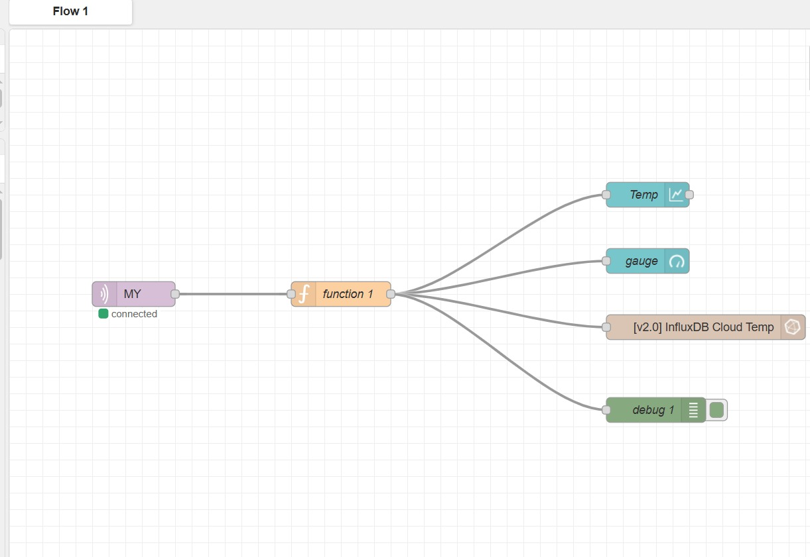
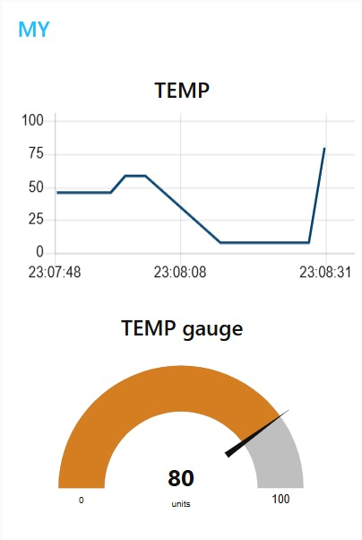
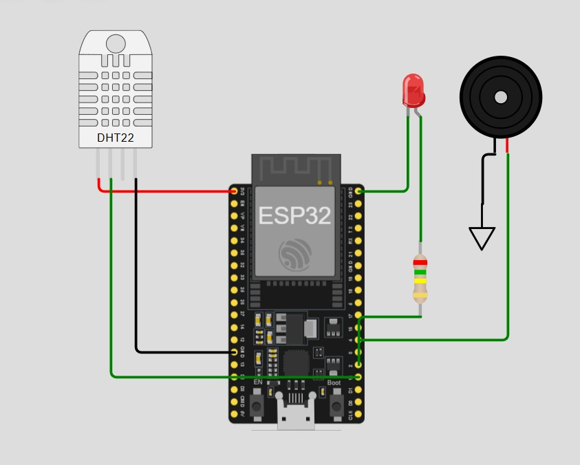
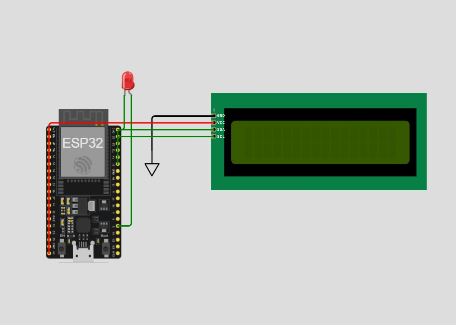
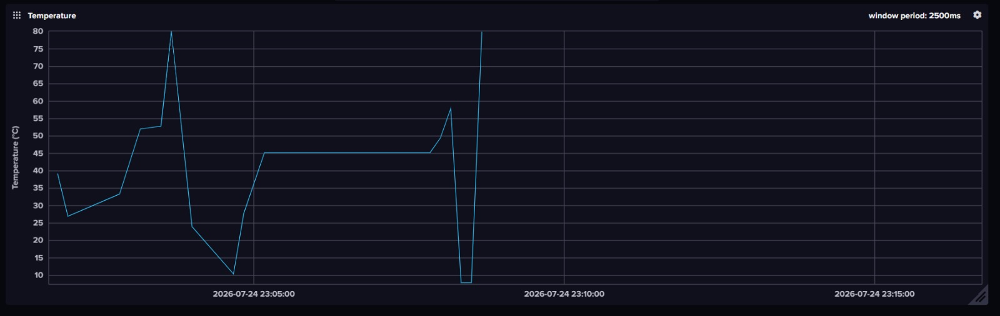
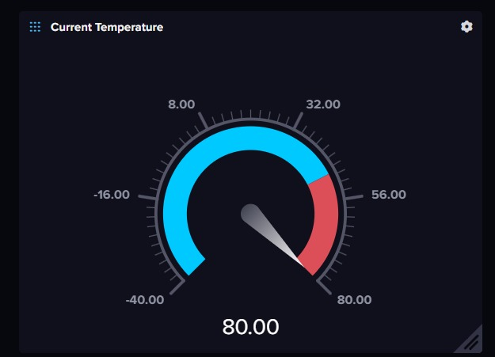

# 🔥 IoT-Based Fire Detection and Remote Monitoring System

IoT-based fire detection and remote monitoring system using ESP32, DHT22, MQTT (HiveMQ), Node-RED, and InfluxDB Cloud for real-time temperature monitoring and alerts.

## 📌 Project Overview

The project aims to detect high-temperature conditions and provide real-time fire monitoring using IoT technologies. The system uses an ESP32 connected to a DHT22 temperature sensor to continuously monitor temperature. When the measured temperature reaches a predefined threshold, the system activates a local alarm using an LED and a buzzer while publishing the temperature and system status through the MQTT protocol via the HiveMQ Broker.

A second ESP32 subscribes to the MQTT topic, displays the received temperature and system status on an I2C LCD, and activates a warning LED whenever a fire condition is detected.

To enable remote monitoring, the published data is processed through Node-RED, stored in InfluxDB Cloud, and visualized on a real-time dashboard that displays both live readings and historical temperature trends.

## ⚙️ Technologies Used

- ESP32
- DHT22 Temperature Sensor
- MicroPython
- MQTT Protocol
- HiveMQ Broker
- Node-RED
- InfluxDB Cloud
- Wokwi Simulation

## 🖥️ Wokwi Simulation

- 🔗 [Sender ESP32 Simulation (Temperature + MQTT Publish)]
          (https://wokwi.com/projects/470459807408009217)
- 🔗 [Receiver ESP32 Simulation (LCD Display + MQTT Subscribe)]
          (https://wokwi.com/projects/470459799306710017)

## 💻 Code

- [`code/esp32_sender.py`](code/esp32_sender.py) — Reads temperature from DHT22, activates local alarm, publishes data via MQTT.
- [`code/esp32_receiver.py`](code/esp32_receiver.py) — Subscribes to MQTT topic, displays data on I2C LCD, activates warning LED.

## 📊 Node-RED Flow

Node-RED processes incoming MQTT data and forwards it to InfluxDB Cloud for storage and visualization.

- [`node-red/flow.json`](node-red/flow.json)

## 🖼️ Project Images

### Sender Circuit (ESP32 + DHT22)

### Receiver Circuit (ESP32 + LCD)

### InfluxDB Dashboard

## 🎥 Demo Video

[Watch the demo](https://youtu.be/zvTk0RccJoc)

## 🙏 Acknowledgements

This project was developed as the final project of the one-month IoT training program at the **National Telecommunication Institute (NTI)**.

Special thanks to the instructors and team members who contributed to this project.
